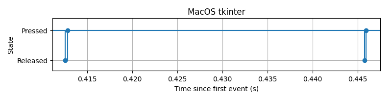

# Study to demonstrate the behaviour of key repeats for different event loops and OSes.

Author: Anustuv Pal

# MacOS `tkinter`

On MacOS running a tkinter event loop, when a key is pressed, the `on_press` and `on_release` register a sequence of key release and key press events.

# MacOS `pynput`

On MacOS running a pynput event loop, when a key is pressed, the `on_press` and `on_release` register simple key presses, and one key release when the user actually releases the key.

# Windows `tk` & `pynput`

Tests on Windows shows that for both tkinter and pynput, the behaviour is the simpler one shown by the pynput event above.

# Observations

We see two different behaviours. We will call them "*releasing*" (MacOS tk) and "*non-releasing*" (others).

# Filtering key repeats

Filtering key repeats for the non-releasing model is simple.
- Keep track of a pressed key
- on_press don't press if the key is already pressed
- on_release release the key

Filtering key repeats for the releasing model is bit more involved.
- For each key the user interacts with record the time of press and release
- on-press check that it was last released > 2ms ago, then press
- on_release wait ~2 ms to see if on_press comes, else release the key.
